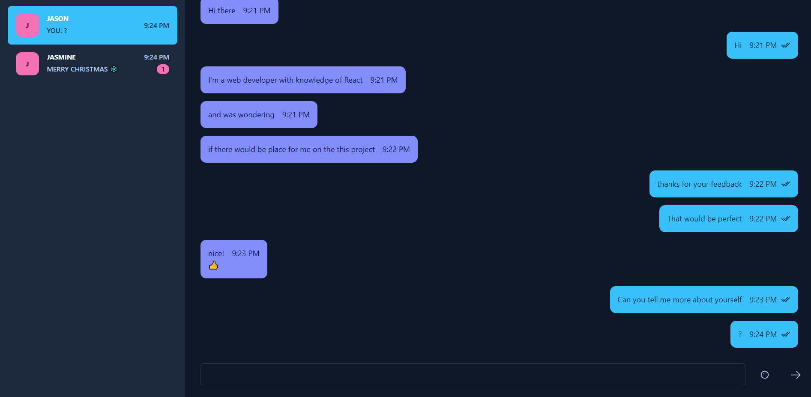

<div align="center">

# Addis
An instant messaging app. Built on top of Node.js and Next.js.



In lots of chat application, I kept encountering the lack of features like seen status and count of unread messages, so I decided to build my own.

</div>

## Getting Started
The project is scaffolded with [Nx.js](https://nx.dev/) as a monorepo.

```bash
# install dependencies
yarn # or just npm install

# run the entire project
nx run-many --target=serve
```

to see detailed instructions on how to serve a single repo, refer to the relevant repo.

## Key Features
* Send/Receive messages instantly.
* See seen status.
* See the count of unread messages per conversation.
* React to the messages with emojis.

## Stack
* [![Node][Node.js]][Node-url]
* [![Nest][Nest.js]][Nest-url]
* [![Mongo][MongoDB]][Mongo-url]
* [![Next][Next.js]][Next-url]
* [![Tailwind][Tailwind]][Tailwind-url]
* [![Redux][Redux]][Redux-url]

## Contributing

Contributions are always welcome!

If you're a front dev seeking to improve the visual experience of the project, feel free to hmu.

Also, if you encountered any bugs, please open an Issue.

## License
[MIT](https://choosealicense.com/licenses/mit/)


[Node.js]: https://img.shields.io/badge/node.js-6DA55F?style=for-the-badge&logo=node.js&logoColor=white
[Node-url]: https://nodejs.dev/en/
[Nest.js]: https://img.shields.io/badge/nestjs-%23E0234E.svg?style=for-the-badge&logo=nestjs&logoColor=white
[Nest-url]: https://nestjs.com/
[MongoDB]: https://img.shields.io/badge/MongoDB-%234ea94b.svg?style=for-the-badge&logo=mongodb&logoColor=white
[Mongo-url]: https://www.mongodb.com/home
[Next.js]: https://img.shields.io/badge/next.js-000000?style=for-the-badge&logo=nextdotjs&logoColor=white
[Next-url]: https://nextjs.org/
[Tailwind]: https://img.shields.io/badge/tailwindcss-%2338B2AC.svg?style=for-the-badge&logo=tailwind-css&logoColor=white
[Tailwind-url]: https://tailwindcss.com/
[Redux]: https://img.shields.io/badge/redux-%23593d88.svg?style=for-the-badge&logo=redux&logoColor=white
[Redux-url]: https://redux.js.org/
